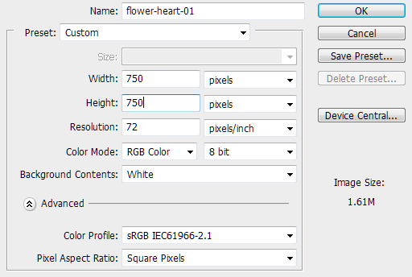
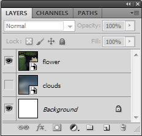
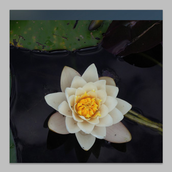
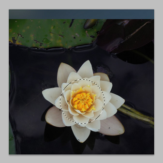
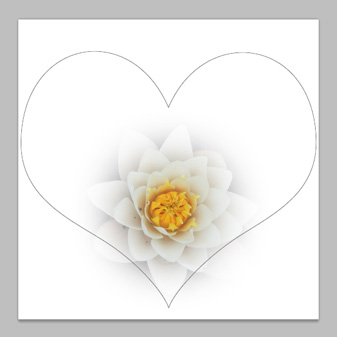
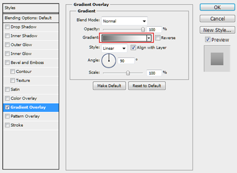
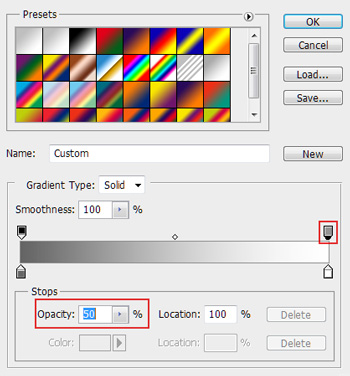

# Using Masking Techniques on a Single Layer

A Photoshop CS5 tutorial on how to use a Layer Mask and a Vector Mask on the same layer.

## Objective

To create a new image with Photoshop CS5 utilizing masking techniques with smart objects and doing so with minimal amount of layers.

---------------------
## Result

----------------------

### Images Used

 From [Pexels.com](http://www.pexels.com):
+ [Lilly Pad Flower](http://www.pexels.com/photo/1483/)
+ [Blurry Clouds](http://www.pexels.com/photo/1250/)

_Tip: Right Click to `Save Link As` or your broswer equivalent_

_Note: These images are [Creative Commons 0](https://creativecommons.org/publicdomain/zero/1.0/)._

## Getting Started

+ Create a new folder for our project.
+ Save the images listed above into that folder.

_Tip: Create a new folder within our project folder named 'assets' and put the images in there._

#### Create a new Photoshop document

1 From the Menu, go to File -> New then set the dimensions to 750px.
2 Name the document `flower-heart-01`
    + 
3 Click Ok
4 From the Menu, go to File -> Save As and save the .psd into our project folder

_Tip: I like to name my files with a numbered suffix._

#### Open Images as Smart Objects

1 From the Menu, go to File -> Open As Smart Object
2 Select the flower image.
    + A new layer will be created with the flower as a smart object.
3 Repeat steps 1 and 2 for the clouds image
4 In the Layers panel drag the clouds layer below the flower layer and click the 'Eye' icon to hide the clouds layer
    + 

#### Create Circle Selection

+ Select the `flower` layer
+ Select the Move Tool (`V`) and position the flower so that it is close to horizontal center and just slightly lower than vertical middle
    + 
+ Select the Marquee Tool (`M`).
    + Make sure it is set to Elliptical Marquee
        + _Tip: if you have to change it, click and hold the Tool from the Tools panel so that the inner panel opens and select `Elliptical Marquee Tool`, or simply press `Shift` + `M` until it displays.
+ Set the Feather to 50 pixels from the Tool Options bar
    + 
+ Hold `Shift` then click and drag out a circle over the flower
    + 

#### Create Layer Mask

+ With the Selection still enabled, from the Menu go to Layer -> Layer Mask -> Reveal Selection

#### Create Paths

+ Select the Custom Shapes Tool (`U`)
+ From the Tool Options bar select the Heart shape. It should be included with the default shapes.
+ From the Tool Options bar turn the Paths option on
+ 
+ Hold `Shift` then click and drag a heart shape so it fills most of the canvas area
+ 

_Tip: If your shape is not exactly where you want it to be, press `A` for the Path Selection Tool and then you can move the path around._

#### Create Vector Mask

+ While still on the `flower` layer and having the path outline still displayed, from the Menu go to Layer -> Vector Mask -> Current Path

--------------------------

We are now finished with the `flower` layer and will move on to the `clouds` layer

---------------------------

#### Create another Vector Mask

+ From the Layers panel  turn on the visibility of the `clouds` layer
+ If you want to feel free to Move (`V`) the layer so that the blend of colors feels right to you.
+ From the Layers panel, click the Paths tab (if you don't see it, from the Menu go to Window -> Paths). There should be the heart path there named `Work Path`.
+ Click the path. Do NOT Ctrl (Cmd) + click.
+ Go back to the Layers tab and ensure the `clouds` layer is selected
+ From the Menu go to Layer -> Vector Mask -> Current Path

### Final Touches

#### Create a Stroke
+ From the Layers tab, create a new Layer. Name it `heartstroke`.
+ From the Paths tab, Ctrl (Cmd) + click the `Work Path`. This will create a selection from the path
+ Go back to the Layers tab and ensure the `heartstroke` layer is selected
+ From the Menu go to Edit -> Stroke
    + Choose 2 pixels for the Stroke Width
    + Choose `#cccccc` for the color
    + Select `Inside` for the Location
    + Leave Blend Mode to `Normal` and Opacity at `100`
    + ! [Stroke Settings](img/stroke-settings.png)

#### Add Styles to the Stroke

##### Add a Gradient Overlay
+ Double-click the `heartstroke` layer to bring up the Layer Styles dialog
+ Click the text for `Gradient Overlay` (not the checkbox) to show the gradient overlay options
+ Click the Gradient color bar
    + 
+ Click the top right square on the gradient scale and set the Opacity to `50`%
    + 
+ Click the bottom left square on the gradient scale and set the color to `#656565`
+ Click Ok

##### Add a Drop Shadow

+ Still within the Layer Styles dialog click the text for `Drop Shadow` (not the checkbox)
    + Set Blend Mode to `Soft Light`
    + Set Opacity to `15`
    + Set Distance to `0`
    + Set Spread to `0`
    + Set Size to `1`

----------------------

Add a nice background image on a new layer and place that layer at the bottom of the other layers and we're done!

_Tip: Edit the black spots from the flower using a combination of each or any of the Healing Brush, Patch, Clone Stamp, or Blur Tools. Note: Showing how to do this is outside the scope of this tutorial, although you may find the edited image in `assets/`._

-----------------------

## Conclusion

We have created sweet looking heart shaped image with a flower inside using both Layer Masks and Vector Masks as well as adding some subtle highlights.

## LIcense

This work is licensed under a [Creative Commons Attribution-NonCommercial-ShareAlike 4.0 International License](http://creativecommons.org/licenses/by-nc-sa/4.0/)

&copy; 2014 Sean T. Unwin

